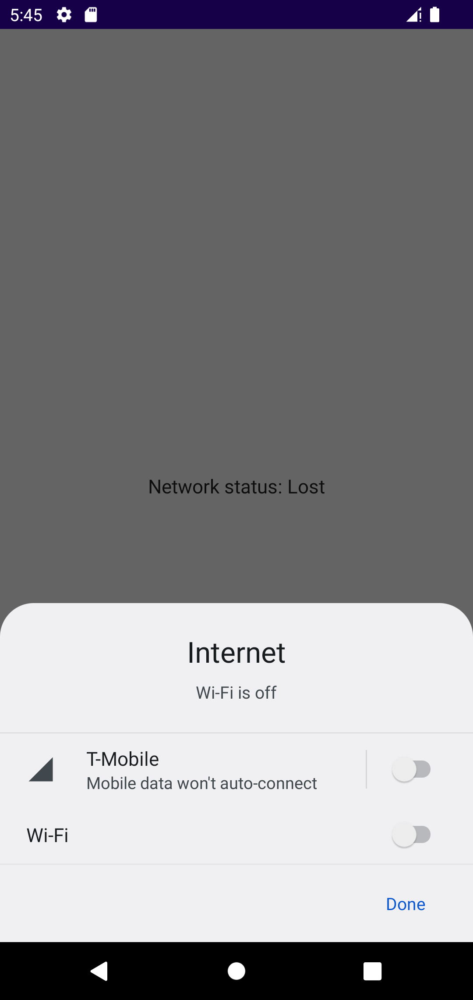

Observe Connectivity
===========

A quick example on how to observe connectivity status.

Since this just a small demo, NetworkConnectivityObserver is created directly in MainActivity instead of the proper way, injecting into ViewModel using Hilt.

Screenshots
-----------

